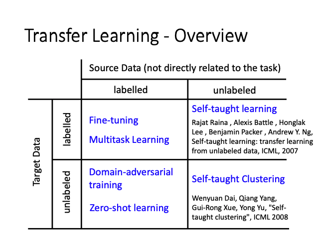
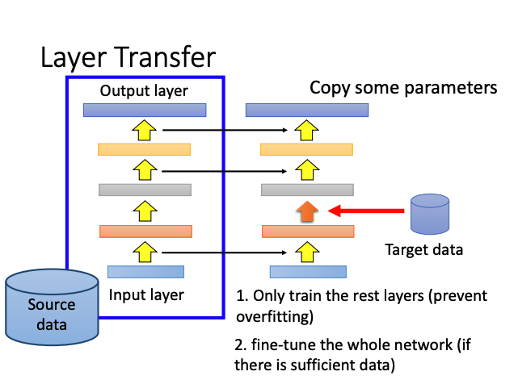
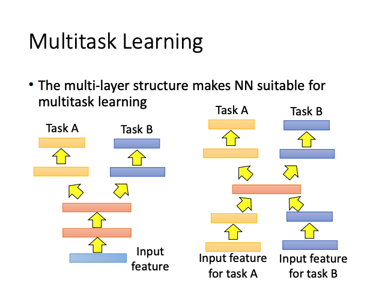
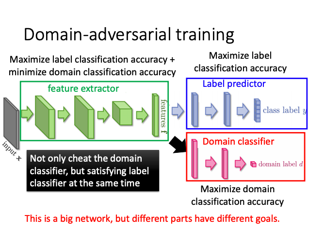
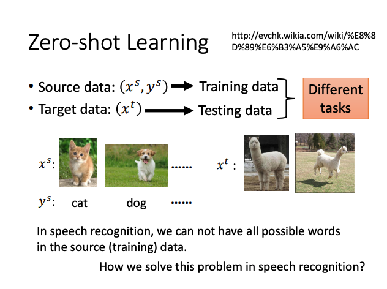
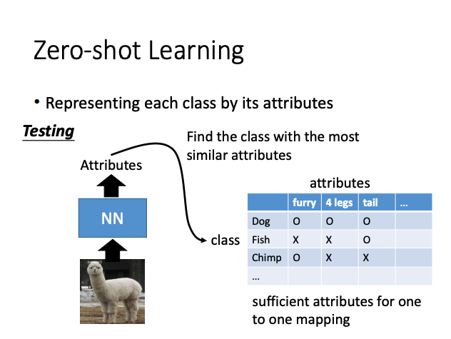

# Transfer Learning

Data **not directly realted to** the task considered.

Similar doamin, different tasks or Different domains, same task.

## Overview

**Different terminology in different literature.**

## Source labelled & Target unlabelled

### Model Fine-tuning

#### Conservatice Training

#### Layer Transfer

Use source data train an multi-layer model, use target data train uncopy layer.

- **Which layer can be transferred ?**
  - **Speech** : usually copy the **last** few layers
  - **Image** : usually copy the **first** few layers

### Multitask Learning

## Source labelled & Target unlabeled

### Domain-adversarial training

Similar to GAN, but domain classifier is easy to "fool".

Domain-adversarial want both of label predictor and domain classifier performance well.

**Use *[ gradient reversal layer ]* between domain classifier and feature extractor, let the feature extractor ignore the domain information.**

***[ gradient reversal layer ]*** : $new gradient desent = gradient desent * (-1) $, Opposite direction of gradient

### Zero-shot learning

**What if we don't have database ? Attribute embedding + word embedding.**

