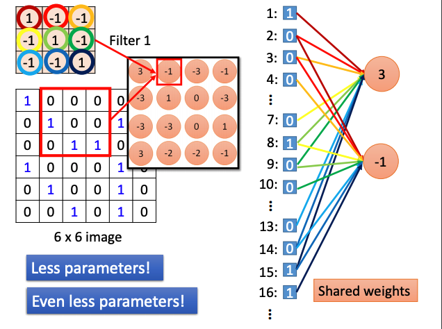

# Notes.3 CNN

## CNN

### Why CNN ？

- **Why CNN for Image ?**
  - **Some patterns are much smaller than the whole image.**
    - A neuron does not have to see the whole image discover the pattern.
    - Connecting to small region with less parameters.
  - **The small patterns appear in different regions.**
    - Different part do almost the same thing,they can use the same set of parameters.
  - **Subsampling the pixels will not change the object.**
    - Less parameters for the network to process the image.

### Convolution

**卷积核(Filter)** ，也称滤波器，与输入特征值做内积（对应位相乘加和）。是CNN需要学习的参数。

每个卷积核（Filter-size：$n*n$）只和 $n*n$ 个输入相连接，而非与所有收入全连接。固定权重，每个卷积核只关注特定的输入特征。

**卷积操作的本质特性包括稀疏交互和参数共享。**

### Activation

激励层将卷积层输出结果做非线性映射。

- **主要激活函数：**
  - **sigmoid** :两端斜率趋向于0，梯度消失
  - **ReLU** :修正线性单元，小概率出现斜率为0的情况
  - **Tips** :
    - CNN慎用 sigmoid 
    - 首先试用 ReLU，如果 ReLU 失效，尝试 Leaky ReLU 或者 Maxout
    - 极少数情况下可尝试 tanh 

### Pooling

池化层，在连续卷积层中间位置，具有特征不变性，可压缩数据和参数量，降低维度，减小过拟合。但会丢失原有的位置信息。经过池化，可得到一个新的更小的图像。

**最大池化(Max Pooling)**  取滑动窗口里的最大值。

**平均池化(Average Pooling)**  取滑动窗口里所有值的平均值。

***Each filter is a channel,the number of the channel is the number of filters.***

### Flatten

全连接层的每一个结点都与上一层的所有结点相连，用来把前边提取到的特征综合起来。由于其全连接的特性，一般全连接层的参数也是最多的。

两层之间所有神经元都有权重连接，通常全连接层在卷积神经网络尾部

### Adv & DisAdv

优点：

- 共享卷积核，优化计算量。
- 无需手动选取特征，训练好权重，即得特征。
- 深层次的网络抽取图像信息丰富，表达效果好。
- 保持了层级网络结构。
- 不同层次有不同形式与功能。

缺点：

- 需要调参，需要大样本量，GPU等硬件依赖。
- 物理含义不明确。

### Questions ？

#### 1×1卷积核

可将 1×1卷积核 看做对输入张量做$Wx$ 过程的共享卷积核参数（全连接网络的权重）的全连接网络。

- 放缩$𝑛_𝑐$的大小

　　通过控制卷积核的数量达到通道数大小的放缩。而池化层只能改变高度和宽度，无法改变通道数。

- 增加非线性

　　1×1卷积核的卷积过程相当于全连接层的计算过程，并且还加入了非线性激活函数，从而可以增加网络的非线性，使得网络可以表达更加复杂的特征。

- 减少参数

　　在Inception Network中，由于需要进行较多的卷积运算，计算量很大，可以通过引入1×1确保效果的同时减少计算量。

