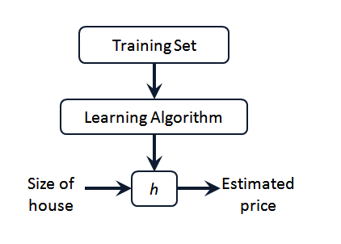
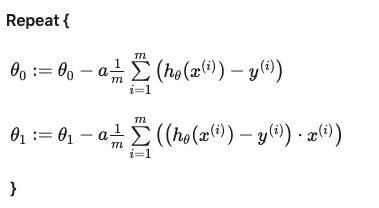
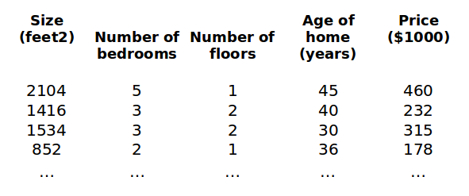
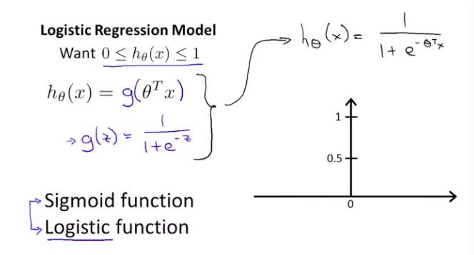
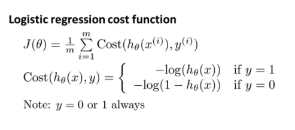
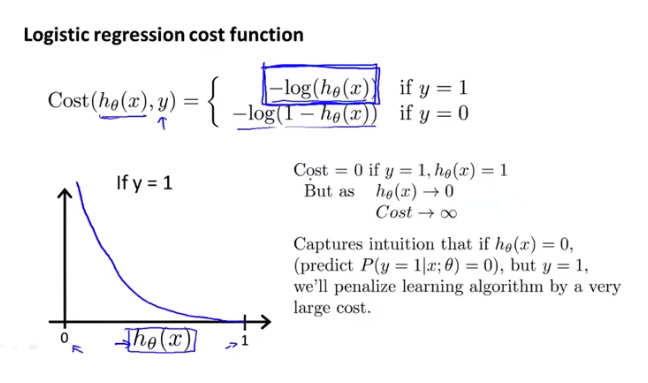
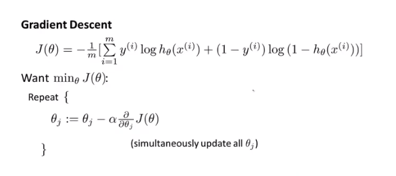
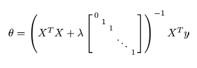
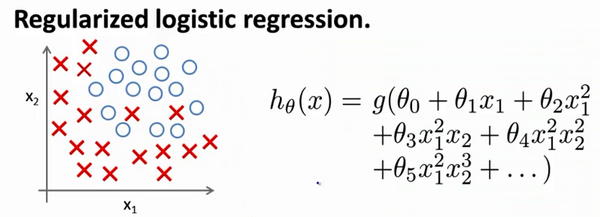

## 第一周笔记 Week_1

### 一、引言

#### 1.1 机器学习

Tom Mitchell :一个计算机程序能够从经验**E**中，解决任务**T**，达到性能度量**P**。有了经验**E**，经过度量**P**评判，程序在处理任务**T**的时候表现提升。

算法分类：监督学习、无监督学习、强化学习、推荐系统等。

问题分类：回归问题 Regression Problem | 分类问题 Classification Problem

#### 1.2 监督学习

监督学习：Supervised Learning

给定算法数据集，数据集中包含正确的Label。例：房价预测、肿瘤类型判断、邮件分类。

#### 1.3 无监督学习

无监督学习：Unspervised Learning

无监督学习中定的数据集中，不包含任何Label。例：聚类，谷歌新闻、鸡尾酒宴。

### 二、单变量线性回归(Univariate Linear Regession)

#### 2.1 模型表示

学习算法( Learning Algorithm )的作用：根据给定的训练集，输出一个假设函数( Hypothesis function : $h$ )。假设函数实际是输入 $x$ 与输出标签 $y$ 之间的函数映射。$h$ 根据输入的$x$计算$y$。

单变量线性回归假设函数：$h_\theta(x) = \theta_0 + \theta_1x$。对于给定的$\theta$，$h_\theta(x)$为$x$的函数。

假设函数都可以写为：$prediction = datamatrix * parameters$

#### 2.2 代价函数

代价函数（Cost Function）：如何去选择 $\theta$ ？

针对房价预测问题，模型所预测的值与训练集中实际值之间的差距（下图中蓝线所指）就是建模误差（modeling error）。

使用均方误差（MSE）作为代价函数。

目标是选择出可以使得建模误差的平方和最小的模型参数：

$minimize_{\theta_0,\theta_1}J(\theta_0,\theta_1)$

#### 2.3 梯度下降

针对已经获得的代价函数 $J(\theta_0,\theta_1)$,希望得到使其取得最小值的参数 $\theta_0$，$\theta_1$ 。

**操作步骤：**

1. 设置初始 $\theta_0$、$\theta_1$,计算 $J(\theta)$
2. 在达到所设阈值前改变 $\theta_0$、$\theta_1$ 减小 $J(\theta)$的值。
   
梯度下降算法每次找到的都是局部最优解，取决于初始参数组合，不一定为全局最优解。

批量梯度下降（batch gradient descent）算法的公式为：

$\alpha$ 是学习率（Learning rate），决定沿着能让代价函数下降程度最大的方向向下迈出的step有多大。

如果学习率 $\alpha$ 过小，那么梯度更新会非常缓慢。如果学习率 $\alpha$ 过大，可能会越过最低点，导致无法收敛甚至发散。每一步参数都更接近最低点，代价函数的导数也逐渐减小，最小值时为0，因此即便 $\alpha$ 不变也可以收敛至最小值。

在批量梯度下降中，每一次都同时让所有的参数减去学习速率乘以代价函数的导数。在梯度更新过程中，所有的参数必须同时更新，每一步计算的 $J(\theta)$ 都是关于所有 $\theta$ 的函数，如果异步更新会导致每次计算的 $J(\theta)$ 发生变化。

对于单变量线性回归、均方误差代价函数，应用梯度下降算法：

同步更新所有参数：

该算法为**批量梯度下降**，即在梯度下降的每一步中，都用到了所有样本，在最后计算过程中需要对m个训练样本进行求平均。

### 三、多变量线性回归(Linear Regression)

#### 3.1 多维特征

针对包含多个特征的回归模型：

$n$ 代表特征的数量

$x^{(i)}$ 代表第 $i$ 个特征实例，是特征距震中的第$i$行，是一个向量(Vector)

$x_j^{(i)}$ 代表特征矩阵中的代表特征矩阵中第 $i$ 行的第 $j$ 个特征，也就是第 $i$ 个训练实例的第 $j$ 个特征

支持多变量的假设 $h$ 表示为: $h_\theta(x) = \theta_0 + \theta_1x_1 + \theta_2x_2 + ... + \theta_nx_n$

引入 $x_0 = 1$，将假设函数化简为 $prediction = datamatrix * parameters$ 的形式，即为 $h_\theta(x) = \theta^TX$ 。参数是一个n+1维的向量，特征矩阵$X$的维度是 $m∗(n+1)$。

#### 3.2 多变量梯度下降

多变量线性回归中，使用均方误差作为代价函数：

与单变量线性回归种不同，其中假设函数：$h_\theta(x) = \theta^TX = \theta_0 + \theta_1x_1 + \theta_2x_2 + ... + \theta_nx_n$，参数为 $\theta_0,\theta_1,...,\theta_n$。

#### 3.3 梯度下降实践

面对多为特征问题时，哟啊保证特征具有相似的尺度，帮助梯度下降算法更快的收敛。

最简单的方法 Mean normalization：

${{x}_{n}}=\frac{{{x}_{n}}-{{\mu}_{n}}}{{{s}_{n}}},(n > 0)$

梯度下降调试Debugging：如何判断梯度下降正确工作。

1. 绘制曲线，正常的梯度下降算法，每一次迭代之后 $J(\theta)$ 都应该下降直至收敛。
2. 设置阈值，达到后结束迭代过程。

#### 3.4 正规方程

梯度下降算法外，对于某些线性回归问题，还可以使用正规方程求解 $\theta$

正规方程求解：$\theta = (X^TX)^{-1}X^Ty$

正规方程求解过程中，可能存在逆矩阵不存在的情况，即 $X^TX$ 为奇异矩阵。通常由于特征之间不独立，例如房价预测中的长、宽与房屋面积；或者是因为特征数量大于训练集数量(删除部分特征或应用正则化regularization)。此时不可以应用正规方程方法。

当特征数量n数量较大时，需选择梯度下降方法，正规方程矩阵计算代价较大。

梯度下降算法可适用于各种场景，但正规方程法只适用于多元线性回归。

### 四、逻辑回归(Logistic Regression)

#### 4.1 分类问题

对于0、1分类问题，使用线性回归输出值可能取值在0，1之间，因此可使用逻辑回归算法，其输出永远在$[0,1]$之间。

Sigmoid function与Logistic function为同义词。

#### 4.2 假说表示、判定边界

$h_\theta(x) = \frac{1}{1+\exp^{-\theta^Tx}}$ 即为假设函数，对于分类问题，$h$的作用是评估在给定$x$的条件下$y=1$的概率。

即：$h_\theta(x) = P(y=1|x;\theta)$

决策界限(Decision boundary)：假设函数的自带属性，取决于 $\theta$ 而不取决于数据集。

#### 4.3 代价函数和梯度下降

对于应用均方差作为代价函数，sigmoid + MSE得到的是非凸函数。

对于逻辑回归，使用新的交叉熵作为代价函数。

得到新的逻辑回归假设函数与代价函数：

对于 $y$ 的不同取值，代价函数表现出不同的趋势。简化后的代价函数为：

$Cost(h_\theta(x),y) = -y*log(h_\theta(x^{(i)}))-(1-y)*log(1-h\theta(x^{(i)}))$

得到假设函数以及代价函数以后就可以应用梯度下降进行最优解$\theta$的求解。

#### 4.4 高级优化与多分类

梯度下降算法的选择：除了梯度下降算法以外，还有一些表现更好的算法：**共轭梯度（Conjugate Gradient），局部优化法(Broyden fletcher goldfarb shann,BFGS)和有限内存局部优化法(LBFGS)** 三种算法内均包含线性搜索算法，可以动态选择适合的学习率。

优化算法的目标是为了**优化最小损失函数**。

针对多分类问题：

1. 一对多：训练多个分类器，为每个类别单独训练一个分类器。计算给定$x$，计算$max_ih_\theta^{(i)}(x)$
2. 多对多：

### 五、正则化

#### 5.1 欠拟合与过拟合

欠拟合Underfit：没有很好的拟合数据集，具有高偏差high bias。

过拟合Overfit：拟合数据集，但无法泛化至新数据，具有高方差high variance。

对于过拟合：

1. 丢弃一些对正确预测没有帮助的特征。可以是手工选择保留哪些特征，或者使用一些模型选择的算法来帮忙（例如PCA）

2. 正则化。 保留所有的特征，但是减少参数的大小（magnitude）。

#### 5.2 正则化线性回归

正则化Regularzition:损失函数 $J(\Theta) = Cost(h_\Theta(x)) + Regularzition$。增加正则化项，在拟合数据的过程中，保证 $\Theta$ 值足够小，简化假设函数。

正则化线性回归的代价函数，对 $\Theta_0$ 不进行正则化：

其中的参数 $\lambda$ 为正则参数，表示对参数的惩罚程度，平衡Cost与正则化项。

对于此代价函数应用梯度下降算法，对于每个参数 $\theta_j,j > 0$，bias项不参与正则化。

在原有算法的更新规则的基础上令 $\Theta_j$ 都减少了一个额外的值。

同样可以对正规方程应用正则化：

图中的矩阵尺寸为 $(n+1)*(n+1)$

#### 5.3 正则化的逻辑回归模型

针对逻辑回归问题，添加正则化项的代价函数为：

同线性回归表达是相同，但其中的假设函数 $h$ 为 $h_\Theta(x) = g(\Theta^TX)$。

注意：

1. 虽然正则化的逻辑回归中的梯度下降和正则化的线性回归中的表达式看起来一样，但由于两者的 $h_\Theta(x)$​ 不同所以还是有很大差别。

2. $\Theta_0$ 不参与其中的任何一个正则化。
